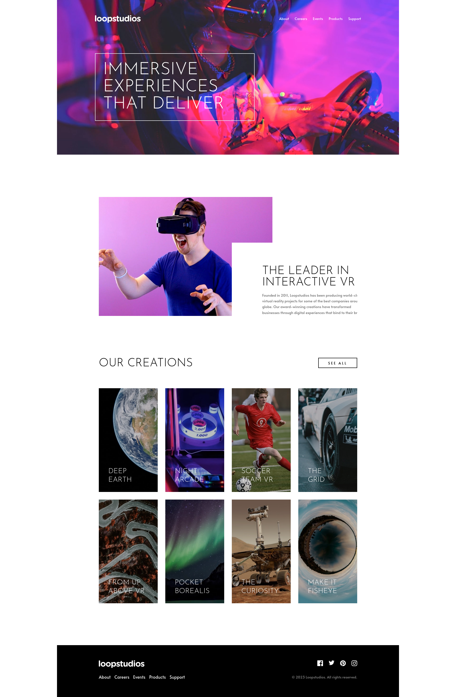

# Frontend Mentor - Loopstudios landing page solution

This is a solution to the [Loopstudios landing page challenge on Frontend Mentor](https://www.frontendmentor.io/challenges/loopstudios-landing-page-N88J5Onjw). Frontend Mentor challenges help you improve your coding skills by building realistic projects.

## Table of contents

- [Overview](#overview)
  - [The challenge](#the-challenge)
  - [Screenshot](#screenshot)
  - [Links](#links)
- [My process](#my-process)
  - [Built with](#built-with)
  - [What I learned](#what-i-learned)
  - [Continued development](#continued-development)
- [Author](#author)

## Overview

### The challenge

Users should be able to:

- View the optimal layout for the site depending on their device's screen size
- See hover states for all interactive elements on the page

### Screenshot



### Links

- Solution URL: [source code](https://github.com/codexshell/loopstudios-landing-page)
- Live Site URL: [live site](https://loopstudios-landing-page-bk0.pages.dev/#)

## My process

### Built with

- Semantic HTML5 markup
- CSS custom properties
- Flexbox
- CSS Grid
- Mobile-first workflow
- [Vue](https://vuejs.org/) - JS library

### What I learned

- Styling child components based on parent status in tailwind
- An example is show below

```html
<div>
  <a class="group" href="#">
    Home
  <hr class="invisible group-active:visible"/>
  </home>
</div>
```

- In the above demonstration the `hr` element will only show when the parent element `a` is clicked on.

### Continued development

- [Astro](https://astro.build/) - Allows you to pull content from anywhere and serve it fast. Apart from that another neat feature is tha it allows you to mix and match components from other UI libraries

## Author

- Website - [Silvanos Eric](https://codexshell.github.io/)
- Frontend Mentor - [@codexshell](https://www.frontendmentor.io/profile/codexshell)
- Twitter - [@codexshell](https://twitter.com/codexshell)
# vue-landing-page
